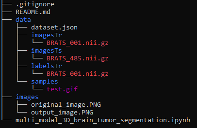

# A multi-modal 3D rumor segmentation model using the 3D Unet model
This repository includes code on the development of a 3D Unet on MRI scan images containing 4 modalities (T2 Flair, T1, T1Gd and T2). The output of the model includes 3 segmentations (Whole tumor, Tumor core and Enhancing tumor) 

## Dataset information

The dataset is a part of the Brats 16/17 challenge and is available at http://medicaldecathlon.com/ .

The ground truth annotation samples are shown in the figure below:

Each instance of the 5 cell classes are annotated separately (Red: Neoplastic; Green: Inflammatory; Dark Blue: Connective; Yellow: Dead; Orange: Epithelial)

The MaskRCNN instance segmentation model was developed using Facebook AI reseach's (FAIR) Detectron 2 framework. 

## Training and inference

The folder structure of this repository is shown below:

The 'Pannuke_dataset' folder contains the original dataset with seperate sub-folders for images and masks. The mask folder contains sub-folders for each cell type present under which each cell instance is given as a separate mask image.

The 'pannuke_pre_processing.ipynb' notebook is used to pre-process and convert the original dataset in a structure that detectron 2 expects.

On succesfully running the pre-processing notebook, a folder called 'final_pannule_dataset' is created along with the train.json and val.json files which are in coco format.

The created folder and json annotation files can be now used to train the MaskRCNN model using the 'pannuke_maskrcnn_training.ipynb' notebook. Inference is done in the same notebook.

## Output
An example of the ground truth (left) and the prediction (right) is shown below:

Gorund Truth                             |Prediction
:-----------------------------------------:|:-----------------------------------------:
  | 

## References

@inproceedings{gamper2019pannuke,
  title={PanNuke: an open pan-cancer histology dataset for nuclei instance segmentation and classification},
  author={Gamper, Jevgenij and Koohbanani, Navid Alemi and Benet, Ksenija and Khuram, Ali and Rajpoot, Nasir},
  booktitle={European Congress on Digital Pathology},
  pages={11--19},
  year={2019},
  organization={Springer}
}

@article{gamper2020pannuke,
  title={PanNuke Dataset Extension, Insights and Baselines},
  author={Gamper, Jevgenij and Koohbanani, Navid Alemi and Graham, Simon and Jahanifar, Mostafa and Khurram, Syed Ali and Azam, Ayesha and Hewitt, Katherine and Rajpoot, Nasir},
  journal={arXiv preprint arXiv:2003.10778},
  year={2020}
}

@misc{Detectron2018,
  author =       {Ross Girshick and Ilija Radosavovic and Georgia Gkioxari and
                  Piotr Doll\'{a}r and Kaiming He},
  title =        {Detectron},
  howpublished = {\url{https://github.com/facebookresearch/detectron}},
  year =         {2018}
}

